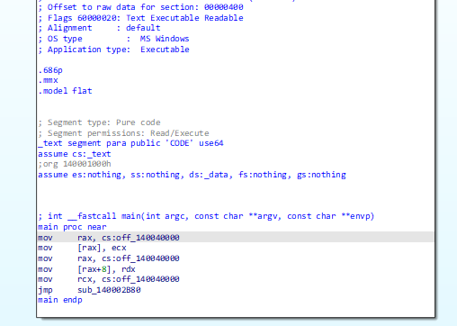
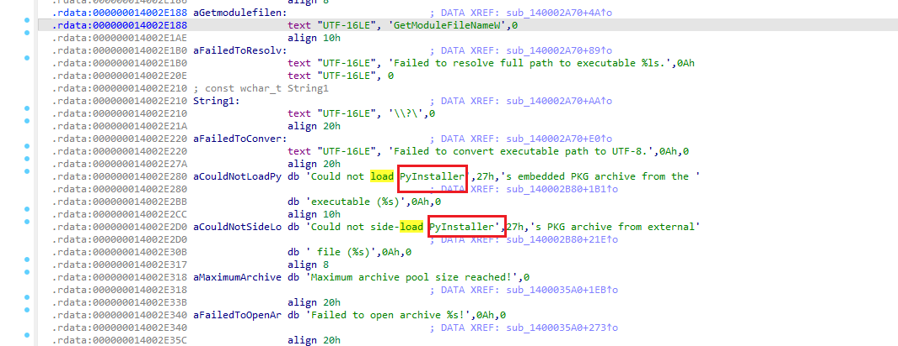

# Python pack to exe

- install pyinstaller:`pip install pyinstaller`

- package python resource `pyinstaller -w -F -i tb.ico xxx.py`

  | Arguement | Description                                                  |
  | --------- | ------------------------------------------------------------ |
  | -F        | generate a single executable file                            |
  | -D        | generate a directory(include multiple files) as executable file |
  | -a        | do not support Unicode                                       |
  | -d        | debug version of executable                                  |
  | -w        | do not show command line when running(Windows only)          |
  | -c        | show command line when running(Windows only)                 |
  | -o        | specify a directory as output dir                            |
  | -p        | set python path                                              |
  | -n        | set project name,ignoring this argument will ukse the first script name as project name |

  

  ```python
  # scriptname:test.py
  a = 1
  b = input()
  c = a+int(b)
  if c > 3:
      print("C > 3")
  else:
      print("C <= 3")
  ```

  

For the script above,we use `pyinstaller -F test.py` to build it as executable file in windows.


# Reverse test

After that,we can reverse the file use IDA



In the main function,it just inialize some data in the cs(code segment) and jump to other block.In the function block.Before start reverse the code,we can take a look at the how Pyinstaller works

## **How PyInstaller Works**

### **1. Analyzing the Python Script and Dependencies**

When you run PyInstaller, it first analyzes the Python script you want to package and identifies all the dependencies, which can include:

- **Standard Library**: Built-in Python libraries like `os`, `sys`, `json`, etc.
- **Third-party Libraries**: Libraries installed via `pip` like `requests`, `numpy`, `pandas`, etc.
- **Custom Modules**: Any modules you created or used in your project.
- **Dynamic Libraries (DLLs or `.so` files)**: If your program depends on compiled C extensions or other dynamic libraries, PyInstaller will include them as well.

### **2. Creating a Bootloader**

PyInstaller generates a small executable, called a **bootloader**, that serves as the entry point for the packaged program. The bootloader’s job is to:

- Load the Python interpreter.
- Load the standard Python libraries and third-party dependencies.
- Load and execute your Python script.

The bootloader is packaged along with the Python program and its dependencies into the final executable file.

### **3. Packaging Dependencies**

Once PyInstaller analyzes the script and its dependencies, it will bundle everything together:

- **Python Interpreter**: PyInstaller embeds the Python interpreter in the executable file.
- **Standard Library and Third-party Libraries**: PyInstaller includes all the necessary Python libraries (both standard and third-party) that the script depends on.
- **Other Files and Resources**: Any additional files (e.g., images, configuration files, etc.) that the script uses are bundled as well.

### **4. Generating the Executable**

PyInstaller packages all the dependencies into an executable file or a folder, depending on the mode you choose:

- **One-file mode**: PyInstaller bundles everything into a single `.exe` file (or equivalent for other platforms). This makes distribution easier but may increase the startup time as it needs to unpack files into memory before execution.
- **One-folder mode**: PyInstaller generates multiple files, including the executable, dynamic libraries, and other resources. This mode avoids the startup time penalty but requires the files to remain in the same directory.

### **5. Runtime Process**

When the packaged executable is run, PyInstaller performs the following steps:

1. **Bootloader Start**: The bootloader is the first part that runs. It initializes the Python runtime environment.
2. **Load Python Interpreter and Libraries**: The bootloader loads the embedded Python interpreter and necessary libraries.
3. **Load Dependencies**: All additional dependencies, including third-party libraries and resources, are loaded into memory.
4. **Execute the Script**: Finally, the bootloader calls the Python interpreter to execute your Python program.


## Reverse Analysis

Based on the above step,we should find out the Bootloader and the Byte code of the source code.

In the above main block,we can jump into the sub block of the main.Here we can find out following comment which shows the effect of the code.



In the normal time,when we find out this string.We can know the packager of the program and use corresponding script to get the reverse code.Here I want to dive deep into the assembly code.

We can look at the top block of these graph

```assembly
push    rbx
mov     eax, 4030h
call    __alloca_probe
sub     rsp, rax
mov     rax, cs:__security_cookie
xor     rax, rsp
mov     [rsp+4038h+var_18], rax
mov     rbx, rcx
lea     rdx, [rsp+4038h+Filename] ; lpFilename
xor     ecx, ecx        ; hModule
mov     r8d, 1000h      ; nSize
call    cs:GetModuleFileNameW
test    eax, eax
jnz     short loc_140002AD0
```

We notice that ,there are 2 calls in the code `__alloca_probe` and `s:GetModuleFileNameW`.The first call is used to allocate stack mem and the second is what we are interested in.It gets Filename,hModule and size as argument and call the function.We can look at this function.

```c
DWORD (__stdcall *GetModuleFileNameW)(HMODULE hModule, LPWSTR lpFilename, DWORD nSize)
```

This function is a windows API used to get the module path by the name.This call is used to get the current path(hModule is NULL) and continue execute.Like execve in Linux.

## Get the origin code

In the executable file,pyinstaller will package the code into .pyc code and unzip it into the binary.We can use binwalk to get the things