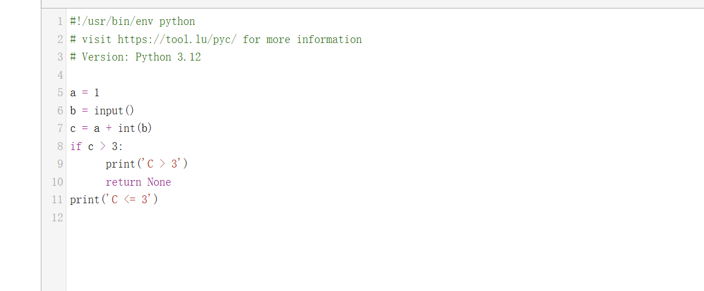

# Python pack to exe

- install pyinstaller:`pip install pyinstaller`

- package python resource `pyinstaller -w -F -i tb.ico xxx.py`

  | Arguement | Description                                                  |
  | --------- | ------------------------------------------------------------ |
  | -F        | generate a single executable file                            |
  | -D        | generate a directory(include multiple files) as executable file |
  | -a        | do not support Unicode                                       |
  | -d        | debug version of executable                                  |
  | -w        | do not show command line when running(Windows only)          |
  | -c        | show command line when running(Windows only)                 |
  | -o        | specify a directory as output dir                            |
  | -p        | set python path                                              |
  | -n        | set project name,ignoring this argument will ukse the first script name as project name |

  

  ```python
  # scriptname:test.py
  a = 1
  b = input()
  c = a+int(b)
  if c > 3:
      print("C > 3")
  else:
      print("C <= 3")
  ```

  

For the script above,we use `pyinstaller -F test.py` to build it as executable file in windows.


# Reverse test

After that,we can reverse the file use IDA


In the main function,it just inialize some data in the cs(code segment) and jump to other block.In the function block.Before start reverse the code,we can take a look at the how Pyinstaller works

## **How PyInstaller Works**

### **1. Analyzing the Python Script and Dependencies**

When you run PyInstaller, it first analyzes the Python script you want to package and identifies all the dependencies, which can include:

- **Standard Library**: Built-in Python libraries like `os`, `sys`, `json`, etc.
- **Third-party Libraries**: Libraries installed via `pip` like `requests`, `numpy`, `pandas`, etc.
- **Custom Modules**: Any modules you created or used in your project.
- **Dynamic Libraries (DLLs or `.so` files)**: If your program depends on compiled C extensions or other dynamic libraries, PyInstaller will include them as well.

### **2. Creating a Bootloader**

PyInstaller generates a small executable, called a **bootloader**, that serves as the entry point for the packaged program. The bootloader’s job is to:

- Load the Python interpreter.
- Load the standard Python libraries and third-party dependencies.
- Load and execute your Python script.

The bootloader is packaged along with the Python program and its dependencies into the final executable file.

### **3. Packaging Dependencies**

Once PyInstaller analyzes the script and its dependencies, it will bundle everything together:

- **Python Interpreter**: PyInstaller embeds the Python interpreter in the executable file.
- **Standard Library and Third-party Libraries**: PyInstaller includes all the necessary Python libraries (both standard and third-party) that the script depends on.
- **Other Files and Resources**: Any additional files (e.g., images, configuration files, etc.) that the script uses are bundled as well.

### **4. Generating the Executable**

PyInstaller packages all the dependencies into an executable file or a folder, depending on the mode you choose:

- **One-file mode**: PyInstaller bundles everything into a single `.exe` file (or equivalent for other platforms). This makes distribution easier but may increase the startup time as it needs to unpack files into memory before execution.
- **One-folder mode**: PyInstaller generates multiple files, including the executable, dynamic libraries, and other resources. This mode avoids the startup time penalty but requires the files to remain in the same directory.

### **5. Runtime Process**

When the packaged executable is run, PyInstaller performs the following steps:

1. **Bootloader Start**: The bootloader is the first part that runs. It initializes the Python runtime environment.
2. **Load Python Interpreter and Libraries**: The bootloader loads the embedded Python interpreter and necessary libraries.
3. **Load Dependencies**: All additional dependencies, including third-party libraries and resources, are loaded into memory.
4. **Execute the Script**: Finally, the bootloader calls the Python interpreter to execute your Python program.

## PyInstaller Executable File Structure

When PyInstaller packages a Python script, it bundles everything into a single executable file. This file contains several distinct parts, each with its specific function:

1. **Header**:
   - **Magic Number**: This marks the beginning of the file and indicates that it is a PyInstaller executable.
   - **PyInstaller Version**: Specifies the version of PyInstaller that was used to create the executable.
   - **Python Version**: The version of Python used to create the executable.
   - **File Length**: The total size of the PyInstaller package.
2. **CArchive (CArchive Section)**: This is the core section of the PyInstaller executable, where all the packed program files, libraries, and other resources are stored. The CArchive section includes:
   - **Magic Number**: Typically a string like `PYTAR` that marks the start of the CArchive section.
   - **Length of Package**: The total size of the package, including the CArchive section and other appended data.
   - **Table of Contents (TOC)**: Contains metadata about all the files in the package, such as file paths, sizes, and offsets.
   - **Python Version**: Indicates which Python version was used when the executable was created.
3. **Overlay Section**:
   - This section, which is usually located at the end of the file, contains additional resources that may be required by the program at runtime, such as images, configuration files, etc. It is optional but common in some PyInstaller executables.
4. **Table of Contents (TOC)**:
   - The Table of Contents stores metadata about the files in the CArchive section. It provides the necessary information (such as file names, paths, and sizes) for the PyInstaller loader to extract the files at runtime.
5. **Entry Point**:
   - The entry point is the code that gets executed when the PyInstaller executable is run. It typically involves loading the embedded Python interpreter, extracting necessary files from the archive, and running the main Python program.

```
+-------------------+
| Header            |  <-- Contains magic number, PyInstaller version, Python version, etc.
+-------------------+
| CArchive          |  <-- Packed program files, libraries, and other resources
|   + Magic Number  |  
|   + Package Length|
|   + Table of Contents (TOC) |
|   + Python Version |
+-------------------+
| Overlay (optional)|  <-- Optional section containing additional resources (images, config files)
+-------------------+
```


### How PyInstaller Works

When a user runs a PyInstaller-generated executable, the following steps generally occur:

1. **Loading**: The header and CArchive section are loaded into memory, starting with the magic number to ensure that the file is a valid PyInstaller executable.
2. **Extracting the Package**: The embedded files (including Python code and dependencies) are unpacked, typically into a temporary directory (e.g., `/tmp` on Linux or `C:\Users\<username>\AppData\Local\Temp` on Windows).
3. **Running the Python Program**: After extraction, the Python interpreter is initialized and the main Python script (or entry point) is executed.
4. **Transparent Unpacking**: In some cases, PyInstaller will unpack the files in memory instead of writing them to disk, making the process faster and more seamless.

### Differences Between PyInstaller 2.0 and 2.1+

There are some key differences in the internal structure between PyInstaller versions 2.0 and 2.1+:

- **PyInstaller 2.0**:
  - The CArchive section is simpler, containing just the magic number, package length, Table of Contents (TOC) position, TOC length, and Python version. This version is less flexible compared to later versions.
- **PyInstaller 2.1+**:
  - Newer versions of PyInstaller added more metadata, such as the `pylibname` field (indicating the name of the Python library). The file format is more complex to support these additional features.
  - PyInstaller 2.1+ also includes more robust handling of runtime dependencies and improves how the package is structured, including potentially a more complex overlay section.

## Reverse Analysis

Based on the above step,we should find out the Bootloader and the Byte code of the source code.

In the above main block,we can jump into the sub block of the main.Here we can find out following comment which shows the effect of the code.


In the normal time,when we find out this string.We can know the packager of the program and use corresponding script to get the reverse code.Here I want to dive deep into the assembly code.

We can look at the top block of these graph

```assembly
push    rbx
mov     eax, 4030h
call    __alloca_probe
sub     rsp, rax
mov     rax, cs:__security_cookie
xor     rax, rsp
mov     [rsp+4038h+var_18], rax
mov     rbx, rcx
lea     rdx, [rsp+4038h+Filename] ; lpFilename
xor     ecx, ecx        ; hModule
mov     r8d, 1000h      ; nSize
call    cs:GetModuleFileNameW
test    eax, eax
jnz     short loc_140002AD0
```

We notice that ,there are 2 calls in the code `__alloca_probe` and `s:GetModuleFileNameW`.The first call is used to allocate stack mem and the second is what we are interested in.It gets Filename,hModule and size as argument and call the function.We can look at this function.

```c
DWORD (__stdcall *GetModuleFileNameW)(HMODULE hModule, LPWSTR lpFilename, DWORD nSize)
```

This function is a windows API used to get the module path by the name.This call is used to get the current path(hModule is NULL) and continue execute.Like execve in Linux.

## Get the origin code

In the executable file,pyinstaller will package the code into .pyc code and unzip it into the binary.We can use binwalk to get the things.Here we will use some tools to reverse this kind of code into source code.

### [pyinstxtractor](https://github.com/extremecoders-re/pyinstxtractor.git)

In this script,we can extract it into following classes:

- CTOCEntry

- PyInstArchive

  - open

  - close

  - checkFile

    ​	inital a chunksize=8192 and read the magic flag to check if this pack is valid.And identify the pyinstaller version based on the reading byte if contain "python"

  - getCArchiveInfo

  - parseTOC

  - _writeRawData

  - extractFiles

  - _fixBarePycs

  - _writePyc

  - _extractPyz

General process:

> 1. Create `PyinsArchive` object
> 2. call `open` to open the file
> 3.  checkFile is valid
> 4. get the table of content
> 5. extract Files based on the table of content

After execute this script,the file will be devided into 3 kind:

- .pyz:a zip file used to zip multiple files
- .pyd:dynamic module of python(like dll)
- .pyc:compiled python code.

### uncompyle6

```bash
pip install uncompyle6
uncompyle6 -o <output_directory> <path_to_pyc_file>
```

In the file generate by pyinstxtractor,we can see a file named `test.pyc`,we can compile it into python code

However,for high version of python,this tools will not work.

### decompyle3

```
pip install decompyle3
```

### online tools

[pyc dis](https://tool.lu/pyc)

[pycdc](https://github.com/zrax/pycdc.git):A C++ based pyc disassemble tools

 

